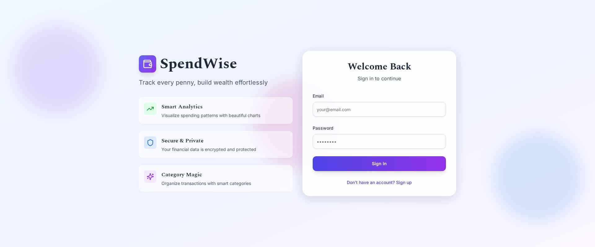
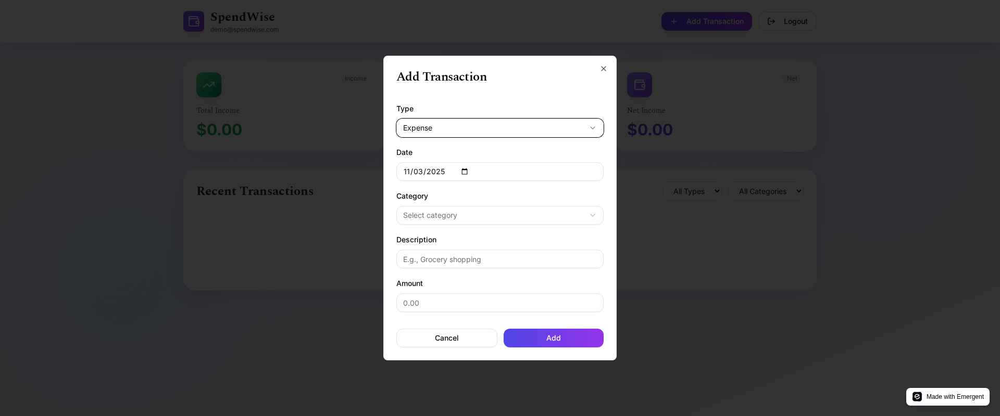
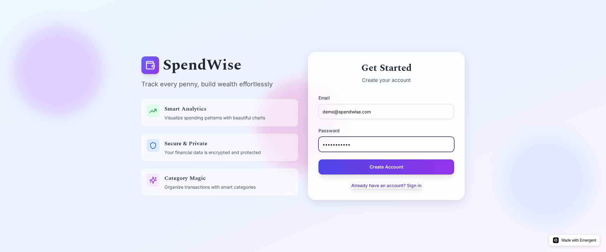
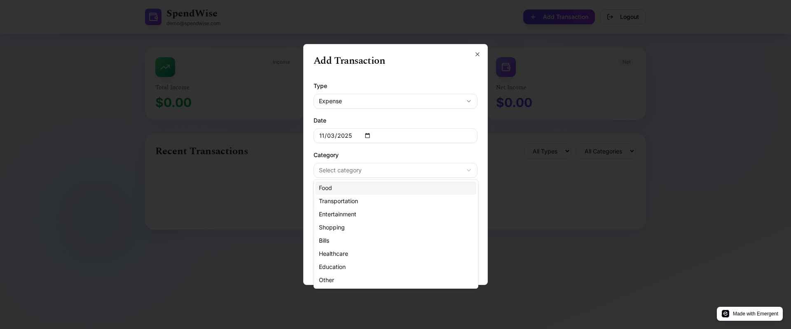

# 💰 SpendWise – Smart Expense Tracker  

[]()
[]()
[]()
[]()

---

### 🌐 Live Demo  
👉 **[SpendWise App](https://spendwise-803.preview.emergentagent.com/)**  

---

## 🧾 Overview  

**SpendWise** is a full-featured **Expense Tracker Web App** built to simplify money management.  
It allows users to **add, categorize, and visualize income & expenses** with real-time balance updates and persistent data storage.  

This project follows a **modular structure** — separating frontend, backend, and testing modules for scalability and clean development.  

---

## ✨ Key Features  

- 💵 **Track Income & Expenses** – Record transactions with date, description, and category.  
- 📊 **Dynamic Calculations** – Auto-updates total income, expenses, and balance.  
- 🏷️ **Categorization** – Organize transactions (Food, Rent, Travel, etc.).  
- 💾 **Local Storage Support** – Retains user data after refresh.  
- 📱 **Responsive Interface** – Works flawlessly across devices.  
- 🧪 **Integrated Testing** – Includes backend test scripts and result reports.  

---

## 🚀 Future Enhancements  

- 🔍 Transaction Filtering & Sorting  
- 📈 Expense Visualization (Pie/Bar Charts)  
- ✏️ Edit Transaction Functionality  
- 📤 Data Export/Import (CSV/JSON)  
- 🌗 Dark/Light Mode  

---

## 🛠️ Tech Stack  

| Layer | Technologies |
|--------|--------------|
| **Frontend** | HTML5, CSS3, JavaScript |
| **Backend** | Node.js (Emergent AI auto-generated setup) |
| **Testing** | Python (Unit Tests), JSON Reports |
| **Deployment** | Emergent AI Hosting |

---

## 📂 Folder Structure  
SpendWise/
│
├── .emergent/ # Auto-generated AI configuration files
├── backend/ # Backend logic and APIs
├── frontend/ # Core HTML, CSS, and JS files
├── test_reports/ # Test result files and reports
├── tests/ # Python test scripts
│
├── .gitignore
├── backend_test.py
├── backend_test_results.json
├── test_result.md
├── README.md
└── assets/ (optional - screenshots, icons)


---

## ⚙️ Run Locally  

1. **Clone this repository**
   ```bash
   git clone https://github.com/yourusername/spendwise.git

2. Navigate to project directory
   ```bash
   cd spendwise

3. Open the frontend
   ```bash
   open frontend/index.html

4. Run backend (if applicable)
   ```bash
   node backend/server.js

## 📸 Screenshots  

| Dashboard | Add Transaction | Summary |  
|------------|----------------|----------|  
|  |  |  |  




## 🧠 Learning Outcomes

• Deepened understanding of Frontend-Backend Integration
• Learned Local Storage & Data Handling in JavaScript
• Improved skills in Responsive Web Design
• Practical experience with Automated Testing & Reports

## 👨‍💻 Developer
Anuj Jha
💬 “Smart spending begins with smart tracking.”
📧 anujha.dev@gmail.com

🌐 LinkedIn
"www.linkedin.com/in/anujjha-dev"

## 🪪 License
This project is licensed under the MIT License.

⭐ If you find this project helpful, please give it a star! ⭐


---

### 💡 Recommended Next Step
Since your repo has **both frontend and backend folders**, you can:
- Add a short **“Setup Backend”** section (if you have APIs).
- Include **GitHub Actions badge** later (for CI/CD test results).
- Add **preview screenshots** (`22.jpg` and your JPEGs) to `assets/` and link them cleanly in the README.

---

Would you like me to make this README **auto-formatted with emoji icons and horizontal dividers** (like a portfolio-grade layout used by top GitHub projects)?  
It’ll look more modern and recruiter-attractive.

